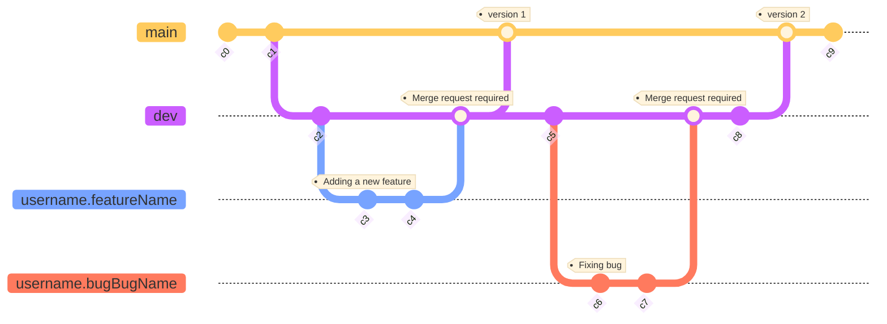

# code - UKT Project

## Description

This repository contains the java eclipse project folder ([UKT_Project](https://gricad-gitlab.univ-grenoble-alpes.fr/Projets-INFO4/23-24/06/code/-/tree/main/UKT_Project)).

The code is separated into 2 packages:

#### [ukt.ui](https://gricad-gitlab.univ-grenoble-alpes.fr/Projets-INFO4/23-24/06/code/-/tree/main/UKT_Project/src/ukt/ui)

This package is used for the user interface

#### [ukt.fc](https://gricad-gitlab.univ-grenoble-alpes.fr/Projets-INFO4/23-24/06/code/-/tree/main/UKT_Project/src/ukt/fc)

This package is used for the functionnal core of the application

## Get started

- Step 1: open your eclipse IDE
- Step 2: click on File -> Open Projects from File System
- Step 3: browse to the UKT_Project eclipse project folder in the git repository you just have cloned
- Step 4: click on Finish button
- Step 5: build the UKT project on eclipse
- Step 6: run UKT project as java application 

Important: you must have java SE SDK 17 installed on your machine

## Diagram of branches

## Contact

- Project manager : alexandre.arle@etu.univ-grenoble-alpes.fr

## Authors
- Alexandre ARLE @arlea (project manager)
- Rémi DEL MEDICO @delmedir
- Axel COLE @coleax
- Emin GUNDOGAN @gundogae
