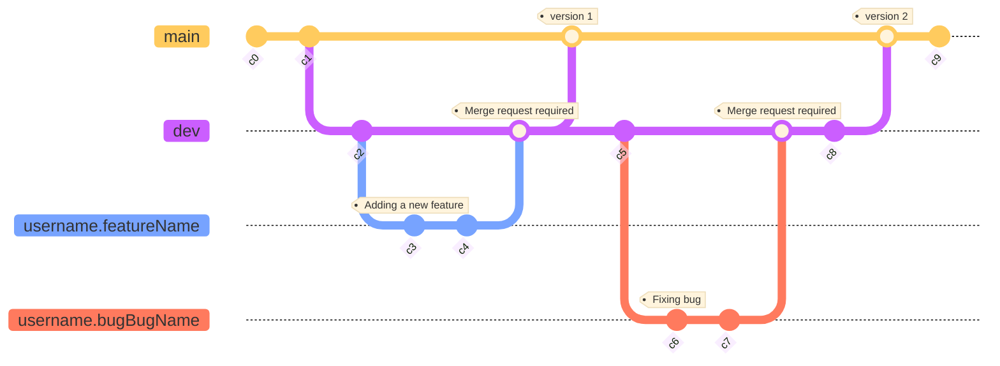

# code - UKT Project

## Description

This repository contains the java eclipse project folder ([UKT_Project](https://gricad-gitlab.univ-grenoble-alpes.fr/Projets-INFO4/23-24/06/code/-/tree/main/UKT_Project)).

The code is separated into multiple packages:

#### [ukt.main](https://gricad-gitlab.univ-grenoble-alpes.fr/Projets-INFO4/23-24/06/code/-/tree/main/UKT_Project/src/ukt/main)

This package is the entry point for our application and contains the main method.

#### [ukt.controller](https://gricad-gitlab.univ-grenoble-alpes.fr/Projets-INFO4/23-24/06/code/-/tree/main/UKT_Project/src/ukt/controller)

This package contains all the classes that make up the application controller.

#### [ukt.model](https://gricad-gitlab.univ-grenoble-alpes.fr/Projets-INFO4/23-24/06/code/-/tree/main/UKT_Project/src/ukt/model)

This package contains all the classes that make up the application model.

#### [ukt.parser](https://gricad-gitlab.univ-grenoble-alpes.fr/Projets-INFO4/23-24/06/code/-/tree/main/UKT_Project/src/ukt/parser)

This package contains the first implementation of our CWL parser.

#### [ukt.test](https://gricad-gitlab.univ-grenoble-alpes.fr/Projets-INFO4/23-24/06/code/-/tree/main/UKT_Project/src/ukt/test)

This package contains the first tests of the application, in particular on the CWL model.

#### [ukt.view](https://gricad-gitlab.univ-grenoble-alpes.fr/Projets-INFO4/23-24/06/code/-/tree/main/UKT_Project/src/ukt/view)

This package contains all the classes that make up the graphical interface of the application.

## Get started on Eclipse

- Step 1: open your eclipse IDE
- Step 2: click on File -> Open Projects from File System
- Step 3: browse to the UKT_Project eclipse project folder in the git repository you just have cloned
- Step 4: click on Finish button
- Step 5: build the UKT project on eclipse
- Step 6: run UKT project as java application by running [ukt.main.Main](https://gricad-gitlab.univ-grenoble-alpes.fr/Projets-INFO4/23-24/06/code/-/blob/main/UKT_Project/src/ukt/main/Main.java). 

Important: you must have java SE SDK 17 installed on your machine

In order to run a CWL workflow you also need to have cwltool installed on your computer. Please install this program by following the instructions [here](https://github.com/common-workflow-language/cwltool).

## Get started with Java jar application

- Step 1: open your terminal
- Step 2: go to repertory where ukt.jar is.  
- Step 3: run java application jar by running ```java -jar ukt.jar``` 

Important: you must have java SE SDK 17 installed on your machine

In order to run a CWL workflow you also need to have cwltool installed on your computer. Please install this program by following the instructions [here](https://github.com/common-workflow-language/cwltool).

## Test the conversion Kenning Graph -> CWL Workflow

- Step 1: open UKT application.
- Step 2: go to File->Convert kenning graph (or press ctrl-k).
- Step 3: upload [specification.json](https://gricad-gitlab.univ-grenoble-alpes.fr/Projets-INFO4/23-24/06/code/-/blob/main/JSON_FILES/specification.json) as specification file and [graph.json](https://gricad-gitlab.univ-grenoble-alpes.fr/Projets-INFO4/23-24/06/code/-/blob/main/JSON_FILES/graph.json) as graph file. 
- Step 4: click on "Convert" button.
- Step 5: now result should appear in the text area.

Notice that result has been saved into /home/UKT repertory on your computer as graph_ID.cwl workflow.

## Test the CWL Workflow creation 

- Step 1: open UKT application.
- Step 2: go to File->Create CWL workflow (or press ctrl-w).
- Step 3: upload [echo.cwl](https://gricad-gitlab.univ-grenoble-alpes.fr/Projets-INFO4/23-24/06/code/-/blob/main/CWL_FILES/echo.cwl) as first CWL file and [](https://gricad-gitlab.univ-grenoble-alpes.fr/Projets-INFO4/23-24/06/code/-/blob/main/CWL_FILES/uppercase.cwl) as second CWL file. 
- Step 4: click on "Merge" button.
- Step 5: merged workflow should appear in the left text-area
- Step 6: click on "Run" button.
- Step 7: result of runned workflow should appear in the right text-area.

Notice that result has been saved into /home/UKT repertory on your computer as echo_uppercase.cwl workflow.

## Diagram of branches


## Contact

- Project manager : alexandre.arle@etu.univ-grenoble-alpes.fr

## Authors
- Alexandre ARLE @arlea (project manager)
- Rémi DEL MEDICO @delmedir
- Axel COLE @coleax
- Emin GUNDOGAN @gundogae
